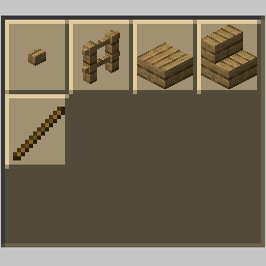

# Cutter Plus

[简体中文](README.md) | [繁體中文](README.cht.md) | [English](README.en.md)

> NOTICE
>> This language file is translated by [fanyi.baidu.com](https://fanyi.baidu.com). If you want to improve the translated content, please create a pull request.



- Datapack supported version: 1.14.4 -> 1.18.1
- Github: [https://github.com/Mo-yis/CutterPlus](https://github.com/Mo-yis/CutterPlus)

## Explain

- A lightweight data package that adds a large number of working formulas for stone-cutter.
- You can even cut wood with a stone-cutter! Emmm... It's OK in life.
- Starting with version "2.4", use the general mineral dictionary label of "Forge".
- Unloaded recipes are filled with "air" to ensure compatibility between multiple mods.
- If you think the air recipe is eye-catching, you can delete the folder starting with "support" corresponding to the uninstalled mod:

```
1. minecraft --------- "Minecraft" was the first supported content.
2. tconstruct -------- "Tinkers' Construct - 1.16.5" is supported from version "2.4".
3. create ------------ "Create - 1.16.5" is supported from version "2.9".
4. twilightforest ---- "The Twilight Forest - 1.16.5" is supported from version "2.10".
5. biomesoplenty ----- "Biomes O' Plenty - 1.16.5" is supported from version "2.11".
6. bayou_blues ------- "Bayou Blues - 1.16.5" is supported from version "2.12".
7. autumnity --------- "Autumnity - 1.16.5" is supported from version "2.13".
8. quark ------------- "Quark - 1.16.5" is supported from version "2.14".
```

## Features

- Blocks that can only be obtained by burning cannot be obtained from a stone cutter, such as the smooth_stones.
- The stone-cutter can only process solid articles and articles without NBT label.(From the design point of view.)
- Blocks of the same type (with different appearance) can be transformed into each other (block, stair, slab, wall).
- The mossy_cobblestone and the mossy_stone_bricks are processed from the cobblestone and the stone_bricks, so they can not be transformed into each other.Other situations are similar.
- Stairs can be processed into corresponding slab.
- Please check the detailed Recipe on WIKI page: [https://github.com/Mo-yis/CutterPlus/wiki](https://github.com/Mo-yis/CutterPlus/wiki)

## Update Plan

- Support for updating module content.
- Add more compatibility formulas between mods.
- Adjust folder directory and standardize file naming.
- Support more mods of 1.16.5.

## Usage

- Github: Click the **green** "**Code**" in the upper right corner and then click "**Download ZIP**".
- If you want to put the datapack into the archive, please unzip it in the ".minecraft \\ saves \\ (save name) \\ datapacks \\ " directory.
- If you are preparing to create a new world, please add the extracted folder to the game.
- If you want to load into a game or server that has already started, please type "/reload" from the console or as a level 3 operator.
- For questions, please check the Minecraft Wiki.

## Warming

- Unlike Mod, datapack are only valid for a single world. However, some mods can share datapacket in multiple worlds.
- Datapack is compatible with a certain range of versions, but it will not be maintained for the old version.
- Do not add datapack with similar or identical functions.
- When the datapack is successfully loaded, the game will prompt "[ datapack name ] Loading Successful !".
- The prompt message cannot be displayed in versions lower than "1.15.2". Please type the command "/datapack list" as an administrator to view the datapack information.
