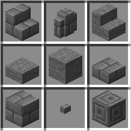

# 切石机增强 Cutter Plus

<div align=right>
    <a src=./README.md>简体中文</a> | <a src=./README.cht.md>繁體中文</a> | <a src=./README.en.md>English</a>
</div>




- 数据包支持版本: 1.14.4 -> 1.18.1
- Github: [https://github.com/Mo-yis/CutterPlus](https://github.com/Mo-yis/CutterPlus)

## 说明

- 一个轻量级数据包，添加了大量切石机的工作配方。
- 你甚至可以用切石机切木头！ Emmm... 在生活中是可以的。
- 从版本 “2.4” 开始，使用 “Forge” 的通用矿物词典标签。
- 未加载的配方使用 “空气” 填充，保证多个模组之间兼容。
- 如果觉得空气配方碍眼，可以将没有的模组对应的以 “support” 开头的文件夹删除：

```
1. minecraft --------- 《Minecraft》是最早支持的内容。
2. tconstruct -------- 《匠魂 - 1.16.5》从版本 “2.4” 开始支持。
3. create ------------ 《机械动力 - 1.16.5》从版本 “2.9” 开始支持。
4. twilightforest ---- 《暮色森林 - 1.16.5》从版本 “2.10” 开始支持。
5. biomesoplenty ----- 《超多生物群系 - 1.16.5》从版本 “2.11” 开始支持。
6. bayou_blues ------- 《长沼蓝调 - 1.16.5》从版本 “2.12” 开始支持。
7. autumnity --------- 《秋原 - 1.16.5》从版本 “2.13” 开始支持。
8. quark ------------- 《夸克 - 1.16.5》从版本 “2.14” 开始支持。
```

## 特性

- 要经过烧炼才能获得的方块无法从切石机获得，如平滑石头。
- 切石机只能加工固态物品和没有NBT标签的物品（从设计的角度上来看）。
- 同一类的方块（材质不同）之间可以相互转化（方块，楼梯，台阶，墙）。
- 苔石和苔石砖是由圆石和石砖加工而来，故不能相互转化。其他情况类似。
- 楼梯可以加工成对应的台阶。
- 请在 WIKI 页面查看详细配方: [https://github.com/Mo-yis/CutterPlus/wiki](https://github.com/Mo-yis/CutterPlus/wiki)

## 计划更新

- 更新模组内容的支持
- 添加更多模组间兼容性配方
- 调整文件夹目录、规范文件命名
- 支持更多 1.16.5 的模组

## 使用方式

- Github: 右上角点击**绿色**的 "**Code**" 再点击 "**Download ZIP**"。
- 如果你打算将数据包放入存档中，请解压在 ".minecraft \\ saves \\ (存档名称) \\ datapacks \\ " 目录下。
- 如果你正准备新建世界，请将解压出的文件夹添加到游戏中。
- 如果你打算加载到已经启动的游戏或服务器中，请在后台或以3级操作员身份键入 "/reload" 以加载数据包。
- 相关疑问请查询 Minecraft Wiki。

## 注意

- 与模组不同，数据包仅对单个世界有效。但是有些 MOD 可以实现在多个世界中共享数据包。
- 数据包兼容一定范围内的版本，但是不会针对旧版本进行维护。
- 请勿添加功能类似或相同的数据包。
- 当数据包成功加载时，游戏中会提示 "[ 数据包名称 ] Loading Successful !"。
- 版本低于 1.15.2 无法显示提示信息，请以管理员身份键入命令 "/datapack list" 查看数据包信息。
